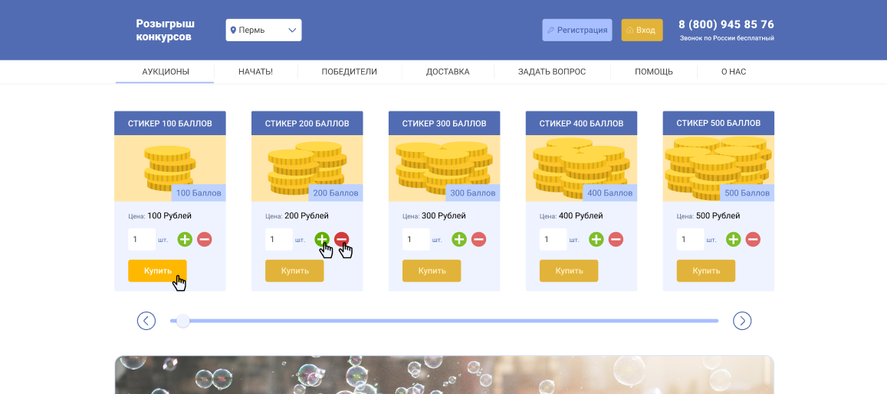

# Lottery layouts

Макеты сайта `сайта розыгрышей`.

## Использование

- **npm run start** - Запуск проекта
- **npm run build** - Сборка проекта
- **localhost:8080** - Сервер

## Структура папок проекта

- **scr/** - Исходные файлы проекта

- **dist/** - Готовые файлы проекта

- **package.json** - Файл зависимостей npm-модулей. В проект устанавливаются все модули, указанные в этом файле. Также в этом файле прописаны npm-скрипты для запуска задач.

- **webpack.config** - Конфиг webpack
